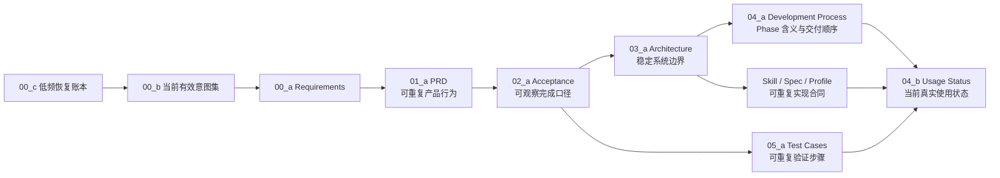

# Babata 文档控制面

<!-- DOC-ID: DOC-INDEX -->
<!-- DOC-AUTHORITY-BOUNDARY: index -->

本文是文档导航、稳定 ID 注册表、编号规则和术语词典。它不定义产品行为、完成口径、架构或
当前进度；这些内容必须进入各自权威文档。

## 强制恢复入口

<!-- BABATA-DOCS-RECOVERY-ENTRY: v1 -->

完整恢复边界包括新 session、上下文压缩、可能丢失控制权/上下文的 Agent 交接或中断、执行状态
不确定的长暂停，以及用户明确说“继续”“恢复”“接着做”。每次都先调用环境可用的
Goal/task-state API，再立即读取
[`DOC-ACTIVE-PLAN`](04_process/04_f_ACTIVE_PLAN.md)，并且只执行其唯一 `CURRENT-ACTIVE`。空 Goal 或
缺失上下文只记为 `unknown`，不能重开 terminal、切换 active 或晋升队列。队列只保存未来恢复入口；
标记 `requires-explicit-resume` 的项目必须等待用户明确恢复。明确返回结果且当前 turn/任务身份完整的
普通同步工具、命令或 API 失败原地处理，不触发完整恢复；有状态操作结果不明时先核对外部状态。

稳定状态机和终端维护只由
[`DOC-INTENT-PLAN-GOVERNANCE`](04_process/04_g_INTENT_AND_PLAN_GOVERNANCE.md) 拥有。根 `AGENTS.md`、
根 `README.md` 和本节只是指向同一权威的浅层钩子，不维护竞争副本。完成恢复身份核对后，才按下列
权威链解释产品与交付内容。

## 1. 权威链

正常解释顺序固定为：当前有效意图集 -> 当前需求 -> PRD -> AC -> Architecture -> Process/TC ->
Usage。00_c 是严重阻塞/漂移/冲突时才使用的逐字恢复证据，不是日常读取的更高频 requirements。
后文可以解释和交付上游决定，但不能静默覆盖上游。Skill/spec/profile 是实现合同，不是新的产品
或状态权威。

## 2. 主链与编号

| Order | DOC-ID | 当前路径 | 唯一职责 |
| --- | --- | --- | --- |
| `index` | `DOC-INDEX` | [`README.md`](README.md) | 文档导航、注册表、编号规则和术语词典 |
| `00_b` | `DOC-WORDING` | [`00_requirements/00_b_USER_WORDING.md`](00_requirements/00_b_USER_WORDING.md) | 当前有效、允许轻度整理的用户意图集；日常上游输入 |
| `00_c` | `DOC-WORDING-RECOVERY` | [`00_requirements/00_c_USER_WORDING_RECOVERY.md`](00_requirements/00_c_USER_WORDING_RECOVERY.md) | 逐字原话与必要已归因上下文；最后关头恢复证据 |
| `00_a` | `DOC-REQ` | [`00_requirements/00_a_REQUIREMENTS.md`](00_requirements/00_a_REQUIREMENTS.md) | 当前用户结果、优先级与不可退让约束 |
| `01_a` | `DOC-PRD` | [`01_prd/01_a_PRD.md`](01_prd/01_a_PRD.md) | 可重复、用户可识别的产品行为 |
| `02_a` | `DOC-AC` | [`02_acceptance/02_a_ACCEPTANCE_CRITERIA.md`](02_acceptance/02_a_ACCEPTANCE_CRITERIA.md) | 可观察的产品通过/失败条件 |
| `03_a` | `DOC-ARCH` | [`03_architecture/03_a_ARCHITECTURE.md`](03_architecture/03_a_ARCHITECTURE.md) | 数据、writer、恢复、依赖与运行边界 |
| `04_a` | `DOC-PROCESS` | [`04_process/04_a_DEVELOPMENT_PROCESS.md`](04_process/04_a_DEVELOPMENT_PROCESS.md) | P0-P9 含义、顺序和交付 gate |
| `04_b` | `DOC-USAGE` | [`04_process/04_b_USAGE_STATUS.md`](04_process/04_b_USAGE_STATUS.md) | 唯一当前真实使用/交付状态与证据指针 |
| `05_a` | `DOC-TC` | [`05_tests/05_a_TEST_CASES.md`](05_tests/05_a_TEST_CASES.md) | 可重复验证场景、步骤与预期；不记当前结果 |

编号规则：

- 顶层 authority 组固定为 `00` 到 `05`，表达文档链顺序，不表达创建时间；组内不使用纯编号文件。
- 每组主文件从 `_a` 开始，后续文档按 `_b/_c/...` 顺延；不得占用后续 authority 组编号。
- 字母文档必须声明 `DOC-AUTHORITY-BOUNDARY`，且不能成为竞争权威。
- `00_b_USER_WORDING.md` 是日常读取的当前有效意图集；先读相关意图，再由 `00_a_REQUIREMENTS.md`
  给出当前 interpreted authority。`00_c_USER_WORDING_RECOVERY.md` 只在正常链无法推进时按索引读取，
  不能每次开工从头回放。
- 已采用文档不得继续使用误导性的 `CANDIDATE` 文件名；真正 candidate 必须有显式状态 marker。

## 3. 补充文档注册表

<!-- DOC-REGISTRY: v1 -->

| DOC-ID | 当前路径 | 状态/职责 | 不拥有 |
| --- | --- | --- | --- |
| `DOC-ARCH-SKELETON` | [`03_architecture/03_b_P2_SYSTEM_SKELETON.md`](03_architecture/03_b_P2_SYSTEM_SKELETON.md) | P2 architecture design record | 当前 inventory、产品或 phase 状态 |
| `DOC-ARCH-RAW` | [`03_architecture/03_c_P3_RAW_FOUNDATION.md`](03_architecture/03_c_P3_RAW_FOUNDATION.md) | P3 C0/first-party architecture supplement | phase 完成结论 |
| `DOC-ROUTES` | [`03_architecture/03_d_SOURCE_ROUTE_REGISTRY.md`](03_architecture/03_d_SOURCE_ROUTE_REGISTRY.md) | live route-research registry；逐来源证据/授权/能力状态 | 用户资料全量完成度 |
| `DOC-KNOWLEDGE-UNIVERSE` | [`03_architecture/03_e_PERSONAL_KNOWLEDGE_UNIVERSE.md`](03_architecture/03_e_PERSONAL_KNOWLEDGE_UNIVERSE.md) | adopted design baseline | 实现状态、当前 usage |
| `DOC-EXT-SOVEREIGN-NAVIGATOR-CANDIDATE` | [`03_architecture/03_f_EXTERNAL_SOVEREIGN_NAVIGATOR_CANDIDATE.md`](03_architecture/03_f_EXTERNAL_SOVEREIGN_NAVIGATOR_CANDIDATE.md) | non-adopted navigator/snapshot/promotion candidate；外部主权原则本身已采用 | 覆盖 current requirements/architecture，或把 adopted premise 降级为 candidate |
| `DOC-MODALITY-LADDER` | [`03_architecture/03_g_C1B_C2B_MODALITY_LADDER.md`](03_architecture/03_g_C1B_C2B_MODALITY_LADDER.md) | adopted architecture supplement | 批次、课程完成状态 |
| `DOC-MBA-ROLLOUT` | [`04_process/04_c_MBA_C2B_ROLLOUT.md`](04_process/04_c_MBA_C2B_ROLLOUT.md) | 可重复逐课程 rollout 方法 | 当前课程进度 |
| `DOC-ACTIVE-PLAN` | [`04_process/04_f_ACTIVE_PLAN.md`](04_process/04_f_ACTIVE_PLAN.md) | 唯一当前执行计划、临时子计划与恢复入口 | 产品意图、当前 usage、长期完成历史 |
| `DOC-INTENT-PLAN-GOVERNANCE` | [`04_process/04_g_INTENT_AND_PLAN_GOVERNANCE.md`](04_process/04_g_INTENT_AND_PLAN_GOVERNANCE.md) | 输入捕获、阶段结论、终端提升与清理合同 | 当前任务、产品需求、usage |

关联实现合同：

| ID | 当前路径 | 职责 |
| --- | --- | --- |
| `SPEC-OUTPUTS` | [`../02_skills/00_specs/09_outputs.md`](../02_skills/00_specs/09_outputs.md) | reusable output contract |
| `PROFILE-SEMANTIC-OBSIDIAN` | [`../02_skills/00_specs/templates/semantic-obsidian-profile.md`](../02_skills/00_specs/templates/semantic-obsidian-profile.md) | accepted semantic Obsidian profile |
| `SKILL-COLLECT` | [`../02_skills/babata-collect/SKILL.md`](../02_skills/babata-collect/SKILL.md) | 单一 C0 收集入口 |
| `SKILL-CLEAN` | [`../02_skills/babata-clean/SKILL.md`](../02_skills/babata-clean/SKILL.md) | provider-neutral C1/C1B 清洗入口 |

路径或文件名变更时，先更新本注册表和对应 `DOC-ID` 文档，再运行 traceability checker 搜索
旧路径。正文讨论优先引用稳定 DOC-ID；需要点击时再附当前相对路径。

## 4. 内容放置规则

| 信息 | Primary authority | 不得维护为 |
| --- | --- | --- |
| 当前用户结果、优先级、不可退让约束 | Requirements | phase 计划、批次历史、实现 recipe |
| 可重复产品能力，包括 dry-run/pilot/profile/full-scope 行为 | PRD | 某批次或课程运行日志 |
| 可观察通过/失败定义 | AC | 当前进度、dated result、命令 transcript |
| 稳定 ownership/writer/data/recovery 边界 | Architecture | 交付顺序、完成声明 |
| P0-P9 含义、顺序、工程/产品 gate | Development Process | 新产品行为、per-batch ledger |
| 当前来源/课程/批次范围与完成度 | Usage Status | PRD、AC、TC、Architecture、plan |
| 可重复验证步骤 | TC | dated execution result、第二份 AC |
| 可重复实现/输出合同 | Skill/spec/profile | 产品优先级、current rollout status |
| 逐来源工具证据和 runtime capability 解释 | Source Research | 用户资料已全量处理 |

`dry-run`、`pilot`、模板/profile 和“系统能处理明确授权范围内每个对象”属于可重复产品行为，
因此进入 PRD。某次 dry-run/pilot、某模板实例 accepted、具体 `N/N`、批次名或
“本范围已全量跑通”属于 usage/evidence，只进入 `DOC-USAGE` 与 Git 外 receipt。Phase 安排能力
成熟顺序，不反向定义产品；一个范围跑完也不自动证明整个 phase 或更大范围完成。

## 5. 核心术语词典

| 术语 | 规范含义 | 易混淆边界 |
| --- | --- | --- |
| Product behavior | 对任意合格输入可重复提供的用户可识别行为 | 不是某次运行结果 |
| Phase | P0-P9 的交付成熟顺序和 gate 集合 | 不是 C0-C3 数据级别，也不新增产品需求 |
| Usage | 明确时间、范围、分母下实际发生的结果 | 不反向改写 PRD/AC |
| Dry-run | 不正式写入/发布地预览范围、动作、限制、成本和失败条件 | 一次 dry-run 成功不是 full run |
| Pilot | 对有界真实范围启用尚未普遍开放的能力并标记不可外推边界 | 不是默认全局可用 |
| Template | 内容槽位和结构骨架；不拥有知识内容 | 某实例是否 accepted 属于 usage |
| Profile | 版本化的输出/验证参数合同 | 不是当前课程状态或 live selector |
| Full-scope run | 对一个明确授权分母逐项处理并报告 success/failed/skipped/gap 的产品行为 | “该范围已经跑完”是 usage |
| Execution round | 冻结输入、目标终端与验收矩阵后连续跑到终端的执行单位 | 普通缺陷轮内记账、轮后成组修；改动后必须新 staging 新轮复验 |
| Evidence / receipt | 支撑一次 gate 或 usage 结论的可核对记录 | 不等于产品定义 |
| Route capability | 某来源 route 在当前 runtime 是否 enabled/disabled/unavailable/absent | 不等于该来源用户资料已处理完 |
| C0/C1/C2/C3 | 原件/派生理解/可重建输出/临时运行层的数据权威级别 | 不是 phase |
| C1A / C1B | 完整清洗派生 / 完整文字加本质与必要模态判断的清洗变体 | C1B 不能用摘要替代完整 C1 文字 |
| C2A / C2B | 通用输出 / 模板保真、多模态语义输出变体 | 都可删重建，不是第二 writer |
| External sovereign library | 外部系统继续拥有完整原件、目录和上下文 | Babata 只拥有受控派生或导航层 |
| Package | publisher 输入的已验证、hash 完整、可重建输出包 | 不是用户 live 入口 |
| Live export | 每门课程唯一的用户可见兼容导出 | 不是权威知识 writer |
| Foundation | 时间/空间/物质/意识的稳定、可重叠世界观观察维度 | 不是四选一或强制穷尽的内容桶 |
| Discipline / Branch | 领域与稳定专业方向；通过有类型的受约束多父 DAG 演进 | 不是课程实例、MBA 集合或课程脑图显示域 |
| Course | 带来源、学期/版本、内容和交付状态的教学单元 | 通过 `covers` 关联 branch，不与同名 branch 合并身份 |
| MBA lens | 版本化、非拥有型 SublibraryDefinition，聚合跨学科课程与内容 | 不是单一 discipline；无真实培养方案需求时不提前建 Program |
| Foundation intensity | 有依据、版本和独立置信度的基石等级/相关强度 | 默认不合计 `100%`，不复用兴趣/战略/共识评分 |
| Writer | 被授权创建正式身份、版本和状态的唯一 application/core 路径 | Skill、脚本、Agent、Obsidian 都不是 writer |
| Candidate | 尚未被上游权威明确采用的建议或设计 | 试点通过不会自动 adopted |
| Adopted | 已被对应上游权威明确接受并进入稳定合同 | 不等于所有 usage 范围已完成 |

## 6. 维护规则

1. 用户拥有 requirements、优先级、进度判断和验收；Agent 维护受影响的下游链、实现和证据。
2. `C2B-DOCS-FIRST-GATE` 和其他产品行为变更统一沿这一条权威顺序 review：
   wording/requirements -> PRD -> AC -> architecture/spec/profile -> process/TC -> implementation -> usage。
   只有真实语义、合同、状态或证据发生变化时才更新对应文档；review 后未受影响的角色在交付报告中
   记为 unchanged，不为满足门禁制造编辑。
3. 只改当前结果：更新 `DOC-USAGE` 和 Git 外 receipt，不触碰 PRD/AC/TC。
4. 只改实现细节：更新 architecture/spec/Skill 和相关 TC；产品行为未变时不制造需求改动。
5. Candidate 采用必须显式回写上游权威、移除误导状态，并更新本注册表。
6. 不为局部调用者创建新 abstraction、module repo、cross-module API 或独立 handoff package。
