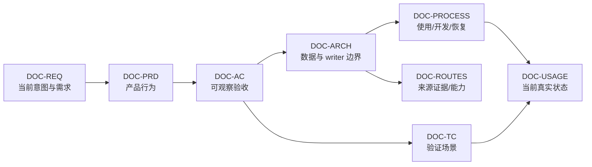

# Babata 文档控制面

<!-- DOC-ID: DOC-INDEX -->
<!-- DOC-AUTHORITY-BOUNDARY: index -->

本文只负责导航、稳定 DOC-ID、编号和术语。产品、状态和执行计划必须进入各自唯一权威。

## 强制恢复入口

<!-- BABATA-DOCS-RECOVERY-ENTRY: v2 -->

完整恢复边界包括新 session、上下文压缩、可能丢失控制/上下文的交接或中断、状态不确定的长暂停，
以及用户明确说“继续”“恢复”等。每次先调用 Goal/task-state API，再立即读取
[`DOC-ACTIVE-PLAN`](04_process/04_c_ACTIVE_PLAN.md)，并且只执行唯一 `CURRENT-ACTIVE`。

空 Goal 或缺失上下文只记为 unknown；已 terminal 工作不得重跑；held/paused/
`requires-explicit-resume` 项不能自动晋升。普通同步命令/API 明确失败且任务身份完整时原地处理。
完整生命周期只由 [`DOC-PROCESS`](04_process/04_a_DEVELOPMENT_PROCESS.md#11-三层恢复结构) 拥有；
根 `AGENTS.md`、根 `README.md` 和本节只是浅层入口。

## 1. 当前权威链

正常解释从 Requirements 开始，只读取当前问题需要的下游权威。P0-P9 历史和精选原话只在审计、
严重漂移或回顾时读取 `DOC-P0-P9-ARCHIVE`；它不参与任务恢复和当前决策。

## 2. 当前文档注册表

<!-- DOC-REGISTRY: v2 -->

| Order | DOC-ID | 当前路径 | 唯一职责 |
| --- | --- | --- | --- |
| index | `DOC-INDEX` | [`README.md`](README.md) | 导航、ID、编号、术语 |
| 00_a | `DOC-REQ` | [`00_requirements/00_a_REQUIREMENTS.md`](00_requirements/00_a_REQUIREMENTS.md) | 当前有效意图与解释后的需求 |
| 01_a | `DOC-PRD` | [`01_prd/01_a_PRD.md`](01_prd/01_a_PRD.md) | 可重复产品行为 |
| 02_a | `DOC-AC` | [`02_acceptance/02_a_ACCEPTANCE_CRITERIA.md`](02_acceptance/02_a_ACCEPTANCE_CRITERIA.md) | 可观察通过/失败条件 |
| 03_a | `DOC-ARCH` | [`03_architecture/03_a_ARCHITECTURE.md`](03_architecture/03_a_ARCHITECTURE.md) | 稳定数据、writer、信任与恢复边界 |
| 03_b | `DOC-ROUTES` | [`03_architecture/03_b_SOURCE_ROUTE_REGISTRY.md`](03_architecture/03_b_SOURCE_ROUTE_REGISTRY.md) | 逐来源工具证据、授权和 capability |
| 04_a | `DOC-PROCESS` | [`04_process/04_a_DEVELOPMENT_PROCESS.md`](04_process/04_a_DEVELOPMENT_PROCESS.md) | usage、round、defect、development、release、docs 和 recovery |
| 04_b | `DOC-USAGE` | [`04_process/04_b_USAGE_STATUS.md`](04_process/04_b_USAGE_STATUS.md) | 当前实际成果、开放项和 evidence pointer |
| 04_c | `DOC-ACTIVE-PLAN` | [`04_process/04_c_ACTIVE_PLAN.md`](04_process/04_c_ACTIVE_PLAN.md) | 唯一活动任务、临时结论和恢复入口 |
| 05_a | `DOC-TC` | [`05_tests/05_a_TEST_CASES.md`](05_tests/05_a_TEST_CASES.md) | 可重复验证步骤和预期 |

只读历史：

| DOC-ID | 路径 | 边界 |
| --- | --- | --- |
| `DOC-P0-P9-ARCHIVE` | [`90_archive/2026-08-23_P0-P9_CLOSEOUT.md`](90_archive/2026-08-23_P0-P9_CLOSEOUT.md) | P0-P9 回顾、经验、精选原话和明确未完成；不拥有当前状态或计划 |

关联实现合同继续位于 `02_skills/`，其中 output spec、profile、collect/clean Skills 只能实现或解释
当前权威，不能新增需求或维护 usage。

## 3. 编号规则

- `00` 到 `05` 表达当前权威链顺序；组内 `_a/_b/_c` 连续补位，不保留已删除文档造成的空号。
- `90_archive` 是显式只读历史分区，不参与当前编号补位，也不进入常规 authority checker 热路径。
- 文件名可变，DOC-ID 是稳定引用；重命名必须同时更新注册表、根入口、Skills、scripts 和 tests。
- 删除现行文档前，独有决定和义务必须被提升到当前权威或归档，并由 Git identity 精确恢复。

## 4. 内容放置

| 信息 | Primary authority | 不得成为 |
| --- | --- | --- |
| 当前意图、结果、优先级、不可退让边界 | Requirements | 历史 transcript、run status |
| 可重复能力和模式 | PRD | 某次批次结果 |
| 可观察通过/失败定义 | AC | 测试脚本或人工审批仪式 |
| 数据、writer、信任、恢复合同 | Architecture | roadmap 或产品意图 |
| 来源正常路线、授权、证据和 capability | Routes | 用户范围完成度 |
| 使用、开发、缺陷、发布、文档和恢复流程 | Process | 新产品行为 |
| 当前版本、成果、缺口和 evidence pointer | Usage | 完整 ledger 或第二份 PRD |
| 唯一当前任务和恢复结论 | Active Plan | backlog、历史仓库 |
| 可重复验证步骤 | TC | 当前执行结果 |
| P0-P9 历史、精选原话和经验 | Archive/Git | 当前 authority 或恢复队列 |

## 5. 核心术语

| 术语 | 含义 |
| --- | --- |
| C0 / C1 / C2 / C3 | 原件或第一方权威 / 清洗派生 / 可重建输出 / 临时运行层 |
| C1A / C1B | 完整文字派生 / 完整文字加必要模态判断 |
| C2A / C2B | 通用输出 / 经过内容、模态、知识和 profile 验证的输出 |
| Writer | 被授权创建正式身份、版本和状态的 application/core 路径 |
| External sovereign library | 外部系统继续拥有原件和 native writer；Babata 拥有受控 snapshot/派生 |
| Snapshot | 带 scope、time、tool、object/path/hash 和 parent/diff 的版本化观察 |
| Sublibrary/lens | 非拥有型范围、关系、查询和物化定义 |
| Package/live | 已验证可重建输出 / 唯一用户可见兼容视图；都不是知识 writer |
| Execution round | 冻结输入/终端后连续运行并统一收敛缺陷的单位 |
| Candidate / adopted / enabled | 建议 / 已进入权威合同 / 当前 runtime 实际可用，三者不可互换 |
| Deferred | 用户明确暂缓；不进入分母且不能自动恢复 |

## 6. 维护规则

1. 用户拥有需求、优先级、价值判断和 acceptance；Agent 负责明确范围内的实现、执行和证据。
2. 语义变化按 Requirements -> PRD -> AC -> Architecture -> Process/TC -> implementation -> Usage 推进。
3. 只改运行结果时更新 Usage/receipt；只改实现时不制造 Requirements/PRD 变化。
4. candidate 采用必须显式进入上游权威，并与 runtime availability 分开。
5. 归档不能删除独有原话、已采用决定、失败恢复、未完成义务或真实 evidence pointer。
